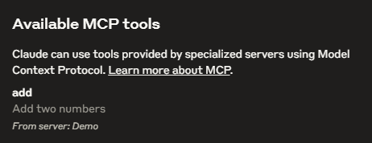
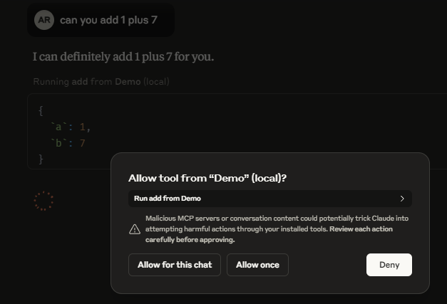

# CustomMCPServer

Build a custom MCP server in Python and connect that to an AI agent.

- Resources:

  - [Python MCP Server SDK](https://github.com/modelcontextprotocol/python-sdk?tab=readme-ov-file)
  - [Reference Code](https://github.com/techwithtim/PythonMCPServer)

- MCP servers are essentially how LLM and AI Tools communicate with each other.The Model Context Protocol allows applications to provide context for LLMs in a standardized way, separating the concerns of providing context from the actual LLM interaction.

```bash
# create a uv-managed project
$ uv init .
Initialized project `custommcpserver` at `C:\Users\abhis\Desktop\AIAgents\CustomMCPServer`
# Then add MCP to your project dependencies:
$ uv add "mcp[cli]"
# activate python environment as well
$ source .venv/scripts/activate
# You can install this server in Claude Desktop and interact with it right away by running:
# mcp install main.py
# since we're in this vs code we do
$ uv run mcp install main.py
[04/16/25 10:06:31] INFO     Added server 'Demo' to Claude config
                    INFO     Successfully installed Demo in Claude app
# go to claude app > File > settings > Developer > Edit Config - opens up some file and open that claude_desktop_config.json file
# we can see the mcp run main.py(path) is added in that file.
# the mcp server should show up on claude app - if it's not - we do the following
# close claude app - open task manager and search fo claude and right click & do end task.
# wait a sec & open the app again
#  once the app loads , it spins up the mcp server and it shows on app - refer the image below & when you click on tool we can see the
# add tool and server:DEMO
```




